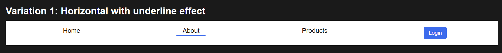
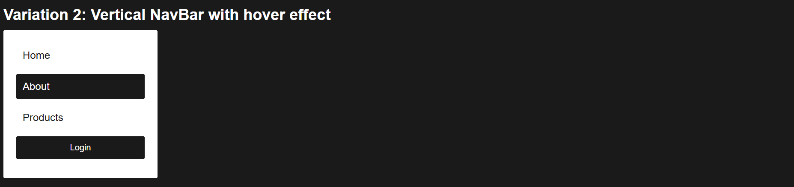
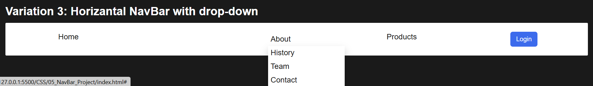

# Navbar Project

This project demonstrates three types of navigation bars (navbars) using HTML and CSS. Each navbar has a unique layout and interaction style, providing examples of horizontal, vertical, and dropdown-based navigation menus.

## Variations

1. **Horizontal Navbar with Underline Effect**:

   - A horizontal navbar where each link has an underline effect on hover.

2. **Vertical Navbar with Hover Effect**:

   - A vertically oriented navbar with links that change style on hover.

3. **Horizontal Navbar with Dropdown Menu**:
   - A horizontal navbar that includes a dropdown menu under the "About" link, providing additional sub-links.

## Features

- **Responsive Design**: The navbars adjust to different screen sizes.
- **Hover Effects**: Links change style on hover to improve user experience.
- **Dropdown Support**: The third variation includes a dropdown menu with additional links.
- **Login Button**: Each navbar includes a "Login" button with a unique style.

## Technologies Used

- **HTML**: For structuring the navigation bar and page content.
- **CSS**: For layout, hover effects, and styling each variation.

## CSS Overview

The CSS file contains styles tailored for each navbar variation to create different layouts and effects.

### General Styles

- **Body Styling**: Sets a dark background (`#1a1a1a`), light text color, and applies padding for overall spacing.
- **Headings and Containers**: Headings (`h2`) and navigation containers (`.nav-container`) have custom margins to organize the navbar variations on the page.

### Navbar 1: Horizontal Navbar with Underline Effect

- **Layout**: Uses `display: flex;` and `justify-content: space-around;` to create a horizontal layout for list items.
- **Link Styling**: Each link has an underline hover effect created with a `::after` pseudo-element that transitions from 0% to 100% width on hover.
- **Login Button**: Styled with a distinct background color (`#3c6bec`) and rounded corners to differentiate it from the links.

### Navbar 2: Vertical Navbar with Hover Effect

- **Vertical Layout**: Styled as a vertical list by setting the width to 200px and using block-level links that occupy the entire row.
- **Hover Effect**: Links change background color and text color on hover for a contrasting effect.
- **Login Button**: Full-width button at the bottom of the menu, styled similarly to Navbar 1 but adjusted for vertical alignment.

### Navbar 3: Horizontal Navbar with Dropdown Menu

- **Horizontal Layout with Flexbox**: This navbar is also horizontal, using `display: flex;` for even spacing.
- **Dropdown Menu**: The `.dropdown` class contains additional links displayed only when hovered over. The `.dropdown-content` uses `position: absolute;` and `display: none;`, appearing on hover to create a dropdown effect.
- **Login Button**: Matches the style of other login buttons but adjusted to fit within the horizontal layout.

Each navbar demonstrates a unique layout or interaction style, making the CSS code both flexible and reusable across different navigation styles.

## Usage

1. **Clone the repository** or download the files.
2. Open `index.html` in your browser to view the three navbar variations.
3. Modify `style.css` to customize colors, fonts, and layout styles.

## File Structure

- **index.html**: Contains the structure for each navbar variation.
- **style.css**: Holds all CSS styles for the navigation bars.

## Code Overview

- **`nav1`**: A horizontal navbar with underline hover effects for each link.
- **`nav2`**: A vertical navbar where links display a hover effect.
- **`nav3`**: A horizontal navbar with a dropdown menu under the "About" link, styled with a dropdown effect.

## Example

> _The above screenshot illustrates the different navigation styles._

---

### Author

Created by [Shubham Mishra]
