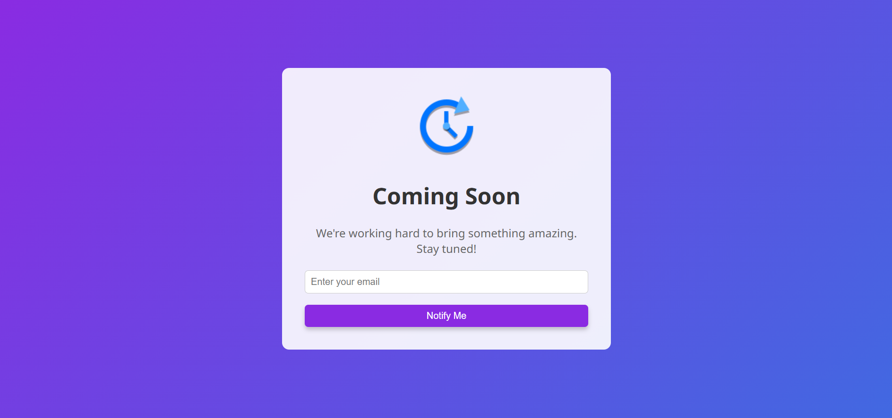

# Coming Soon Webpage

This project is a simple, visually appealing "Coming Soon" landing page designed to notify users of a forthcoming website or service. It includes a brief description, a notification form to collect email addresses, and a responsive design with vibrant colors and modern styling.

## Preview

The page displays a "Coming Soon" message with a notification form allowing users to subscribe for updates. The gradient background, central layout, and rounded elements provide a professional and inviting look.

## Technologies Used

- **HTML**: Provides the structure of the page.
- **CSS**: Applies styles and layout adjustments, including a gradient background, centered content, and hover effects on buttons.
- **Google Fonts**: Implements custom typography for a modern and clean font style.

## Structure and Design

### HTML Structure

- The HTML file includes:
  - A container with centered content for the "Coming Soon" message.
  - A logo image, heading, and description.
  - An email input form with a "Notify Me" button.

### CSS Styling

- **Background**: A linear gradient (135 degrees) from purple to royal blue.
- **Content Container**: A centered box with rounded corners, shadow effects, and a semi-transparent white background.
- **Button**: Styled with a purple background, white text, rounded corners, and a hover effect.
- **Form**: Vertically aligned with rounded input fields and a responsive design.

## Installation and Usage

1. Clone or download the project.
2. Open `index.html` in a browser to view the landing page.

## Code Snippets

### HTML

```html
<div class="container">
  <div class="content">
    
    <h1>Coming Soon</h1>
    <p>We're working hard to bring something amazing. Stay tuned!</p>
    <form id="notify-form">
      <input type="email" placeholder="Enter your email" required />
      <button type="submit">Notify Me</button>
    </form>
  </div>
</div>
```

## CSS

```CSS
@import url("https://fonts.googleapis.com/css2?family=Noto+Sans:ital,wght@0,100..900;1,100..900&display=swap");

body,
html {
  margin: 0;
  padding: 0;
  font-family: "Noto Sans", sans-serif;
  height: 100%;
}

.container {
  background: linear-gradient(135deg, #8a2be2, #4169e1);
  display: flex;
  justify-content: center;
  align-items: center;
  height: 100%;
}

.content {
  text-align: center;
  background-color: rgba(255, 255, 255, 0.9);
  padding: 2rem;
  border-radius: 10px;
  max-width: 400px;
}

.logo {
  width: 100px;
  object-fit: contain;
}

h1 {
  color: #333;
  margin-bottom: 20px;
}

p {
  color: #666;
  margin-bottom: 20px;
}

form {
  display: flex;
  flex-direction: column;
}

input[type="email"] {
  padding: 0.5rem;
  border-radius: 5px;
  border: 1px solid #ccc;
  margin-bottom: 1rem;
}

button {
  padding: 0.5rem;
  background-color: #8a2be2;
  color: #fff;
  border: none;
  border-radius: 5px;
  cursor: pointer;
  box-shadow: 0 4px 6px rgba(0, 0, 0, 0.2);
  transition: background-color 0.3s ease-in-out;
}

button:hover {
  background-color: #7a1dd1;
}
```

## Preview


