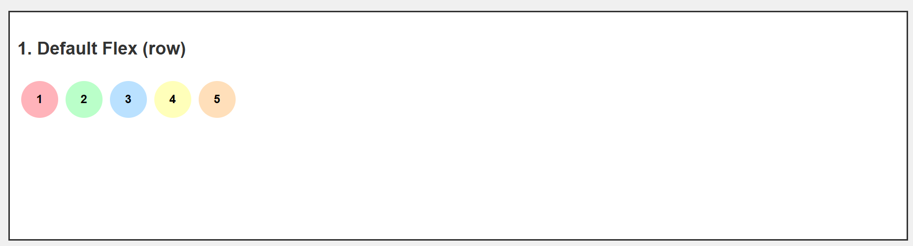
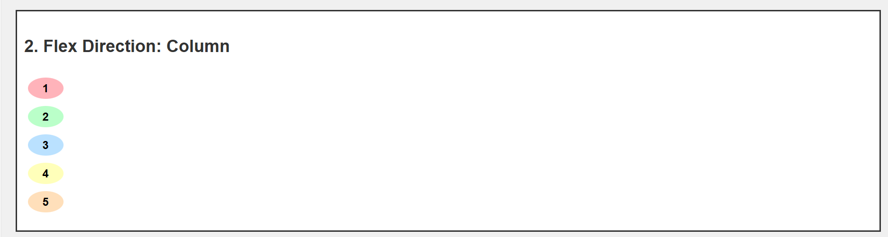
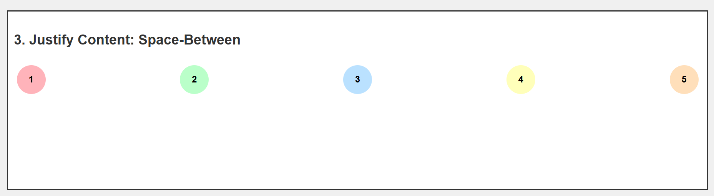
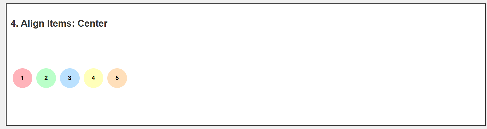
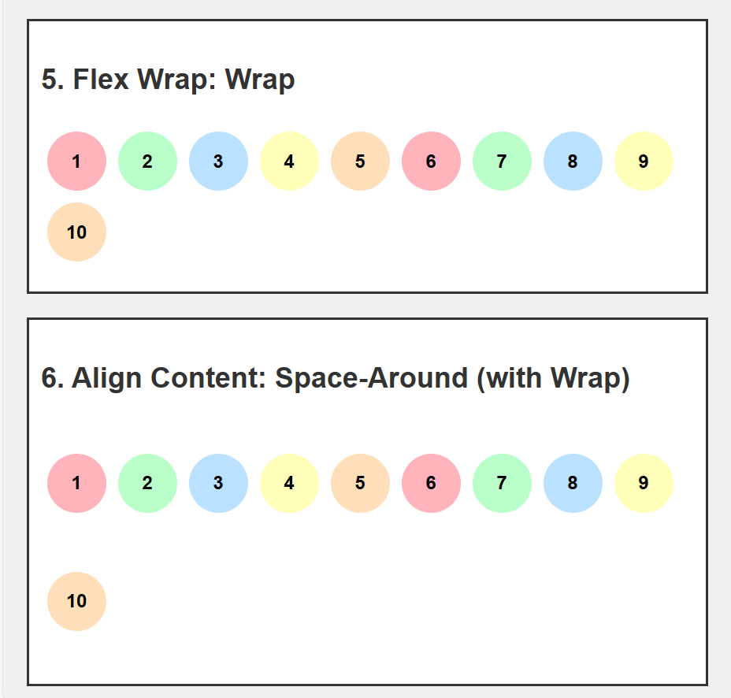
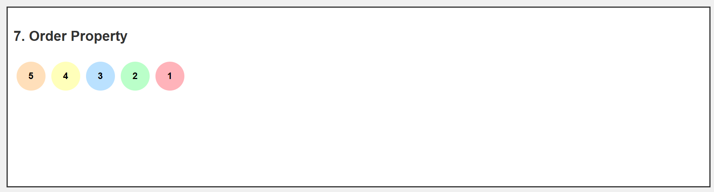
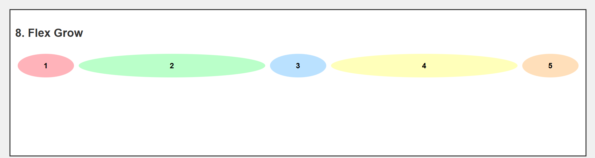
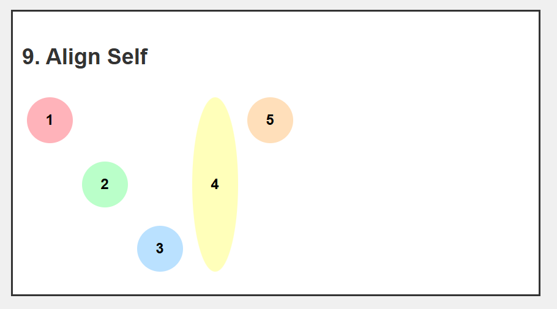

# CSS Flexbox Guide

Flexbox is a CSS layout model that allows items in a container to be arranged flexibly and responsively along a row or column. It's ideal for creating adaptable layouts without complex float or positioning hacks.

## Flex Container Properties

These properties are applied to the flex container (the parent element that contains the flex items).

- **`display: flex`**  
  Turns an element into a flex container, enabling all the flex properties on its children.

- **`flex-direction`**  
  Defines the main axis along which items are arranged.

  - `row` (default): Horizontal, left-to-right.
  - `row-reverse`: Horizontal, right-to-left.
  - `column`: Vertical, top-to-bottom.
  - `column-reverse`: Vertical, bottom-to-top.

- **`justify-content`**  
  Aligns items along the main axis.

  - `flex-start`: Items align to the start.
  - `flex-end`: Items align to the end.
  - `center`: Items align to the center.
  - `space-between`: Even spacing between items.
  - `space-around`: Even spacing around items.
  - `space-evenly`: Equal spacing between and around items.

- **`align-items`**  
  Aligns items along the cross axis (perpendicular to the main axis).

  - `flex-start`: Items align to the start.
  - `flex-end`: Items align to the end.
  - `center`: Items align to the center.
  - `baseline`: Items align along their baselines.
  - `stretch`: Items stretch to fill the container.

- **`flex-wrap`**  
  Determines if items should wrap onto multiple lines if they overflow.

  - `nowrap` (default): Items stay on one line.
  - `wrap`: Items wrap onto new lines as needed.
  - `wrap-reverse`: Items wrap onto new lines in reverse order.

- **`align-content`**  
  Aligns multiple lines of items within the flex container when there is extra space along the cross axis.
  - `flex-start`, `flex-end`, `center`, `space-between`, `space-around`, `stretch`

## Flex Item Properties

These properties are applied to individual flex items within the container.

- **`flex-grow`**  
  Controls how much a flex item will grow relative to other items in the container when extra space is available.

  - `flex-grow: 1` allows an item to take up available space proportionally.

- **`flex-shrink`**  
  Determines how much an item will shrink relative to other items when there’s not enough space.

- **`flex-basis`**  
  Specifies the initial size of an item before any growing or shrinking.

- **`align-self`**  
  Overrides the container’s `align-items` property for an individual item.
  - `flex-start`, `flex-end`, `center`, `baseline`, `stretch`

## Example Usage

Here’s a simple example of a Flexbox layout:

## HTML AND CSS

```HTML
<!DOCTYPE html>
<html lang="en">
  <head>
    <meta charset="UTF-8" />
    <meta name="viewport" content="width=device-width, initial-scale=1.0" />
    <title>Flexbox Masterclass Demo</title>
    <style>
      body {
        font-family: Arial, sans-serif;
        line-height: 1.6;
        margin: 0;
        padding: 20px;
        background-color: #f0f0f0;
      }
      h1,
      h2 {
        color: #333;
      }
      .container {
        background-color: #fff;
        border: 2px solid #333;
        margin-bottom: 20px;
        padding: 10px;
      }
      .flex-container {
        display: flex;
        height: 200px;
        margin-bottom: 10px;
      }
      .circle {
        width: 50px;
        height: 50px;
        border-radius: 50%;
        display: flex;
        justify-content: center;
        align-items: center;
        font-weight: bold;
        margin: 5px;
      }
      .pastel-1 {
        background-color: #ffb3ba;
      }
      .pastel-2 {
        background-color: #baffc9;
      }
      .pastel-3 {
        background-color: #bae1ff;
      }
      .pastel-4 {
        background-color: #ffffba;
      }
      .pastel-5 {
        background-color: #ffdfba;
      }
    </style>
  </head>
  <body>
    <h1>Flexbox Masterclass Demo</h1>

    <div class="container">
      <h2>1. Default Flex (row)</h2>
      <div class="flex-container">
        <div class="circle pastel-1">1</div>
        <div class="circle pastel-2">2</div>
        <div class="circle pastel-3">3</div>
        <div class="circle pastel-4">4</div>
        <div class="circle pastel-5">5</div>
      </div>
    </div>

    <div class="container">
      <h2>2. Flex Direction: Column</h2>
      <div class="flex-container" style="flex-direction: column">
        <div class="circle pastel-1">1</div>
        <div class="circle pastel-2">2</div>
        <div class="circle pastel-3">3</div>
        <div class="circle pastel-4">4</div>
        <div class="circle pastel-5">5</div>
      </div>
    </div>

    <div class="container">
      <h2>3. Justify Content: Space-Between</h2>
      <div class="flex-container" style="justify-content: space-between">
        <div class="circle pastel-1">1</div>
        <div class="circle pastel-2">2</div>
        <div class="circle pastel-3">3</div>
        <div class="circle pastel-4">4</div>
        <div class="circle pastel-5">5</div>
      </div>
    </div>

    <div class="container">
      <h2>4. Align Items: Center</h2>
      <div class="flex-container" style="align-items: center">
        <div class="circle pastel-1">1</div>
        <div class="circle pastel-2">2</div>
        <div class="circle pastel-3">3</div>
        <div class="circle pastel-4">4</div>
        <div class="circle pastel-5">5</div>
      </div>
    </div>

    <div class="container">
      <h2>5. Flex Wrap: Wrap</h2>
      <div class="flex-container" style="flex-wrap: wrap; height: auto">
        <div class="circle pastel-1">1</div>
        <div class="circle pastel-2">2</div>
        <div class="circle pastel-3">3</div>
        <div class="circle pastel-4">4</div>
        <div class="circle pastel-5">5</div>
        <div class="circle pastel-1">6</div>
        <div class="circle pastel-2">7</div>
        <div class="circle pastel-3">8</div>
        <div class="circle pastel-4">9</div>
        <div class="circle pastel-5">10</div>
      </div>
    </div>

    <div class="container">
      <h2>6. Align Content: Space-Around (with Wrap)</h2>
      <div
        class="flex-container"
        style="flex-wrap: wrap; align-content: space-around"
      >
        <div class="circle pastel-1">1</div>
        <div class="circle pastel-2">2</div>
        <div class="circle pastel-3">3</div>
        <div class="circle pastel-4">4</div>
        <div class="circle pastel-5">5</div>
        <div class="circle pastel-1">6</div>
        <div class="circle pastel-2">7</div>
        <div class="circle pastel-3">8</div>
        <div class="circle pastel-4">9</div>
        <div class="circle pastel-5">10</div>
      </div>
    </div>

    <div class="container">
      <h2>7. Order Property</h2>
      <div class="flex-container">
        <div class="circle pastel-1" style="order: 5">1</div>
        <div class="circle pastel-2" style="order: 4">2</div>
        <div class="circle pastel-3" style="order: 3">3</div>
        <div class="circle pastel-4" style="order: 2">4</div>
        <div class="circle pastel-5" style="order: 1">5</div>
      </div>
    </div>

    <div class="container">
      <h2>8. Flex Grow</h2>
      <div class="flex-container">
        <div class="circle pastel-1" style="flex-grow: 1">1</div>
        <div class="circle pastel-2" style="flex-grow: 5">2</div>
        <div class="circle pastel-3" style="flex-grow: 1">3</div>
        <div class="circle pastel-4" style="flex-grow: 5">4</div>
        <div class="circle pastel-5" style="flex-grow: 1">5</div>
      </div>
    </div>

    <div class="container">
      <h2>9. Align Self</h2>
      <div class="flex-container">
        <div class="circle pastel-1" style="align-self: flex-start">1</div>
        <div class="circle pastel-2" style="align-self: center">2</div>
        <div class="circle pastel-3" style="align-self: flex-end">3</div>
        <div class="circle pastel-4" style="align-self: stretch; height: auto">
          4
        </div>
        <div class="circle pastel-5">5</div>
      </div>
    </div>
  </body>
</html>
```

## Preview









