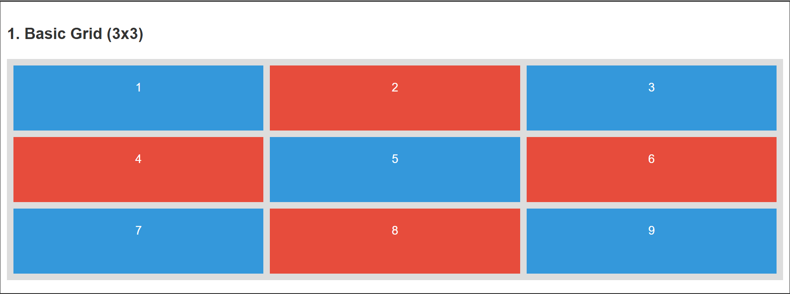
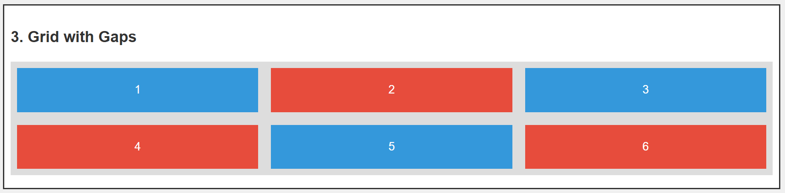
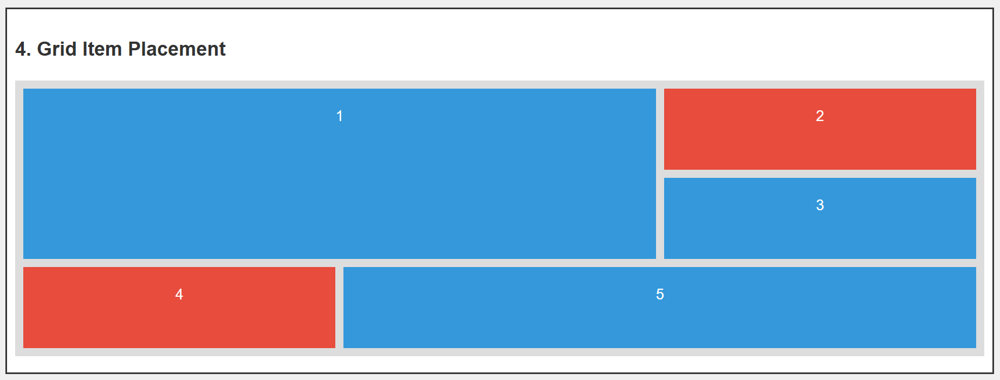
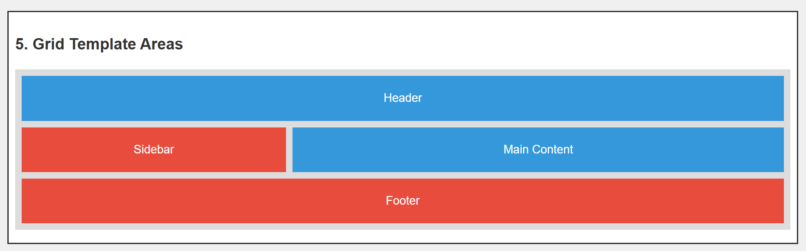
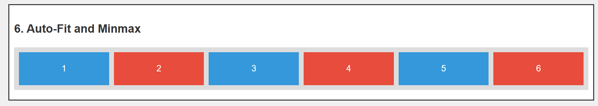
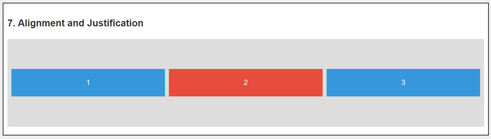
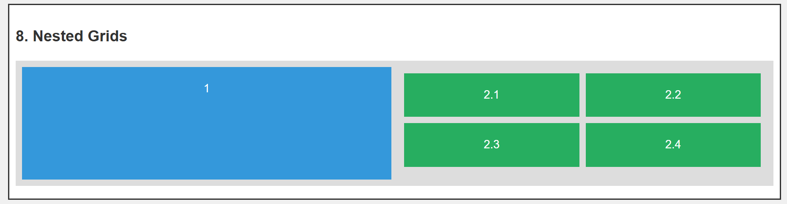

# CSS Grid Layout Guide

CSS Grid Layout is a powerful layout system in CSS that enables you to create complex, responsive web layouts with ease. It is a two-dimensional system, meaning you can control both rows and columns simultaneously.

---

## Table of Contents

1. [What is CSS Grid?](#what-is-css-grid)
2. [Key Properties](#key-properties)
3. [Basic Grid Concepts](#basic-grid-concepts)
4. [Examples](#examples)
5. [Additional Resources](#additional-resources)

---

## What is CSS Grid?

CSS Grid Layout is a modern layout system designed to handle both rows and columns in web layouts. It gives developers control over the positioning and sizing of items in a grid container.

---

## Key Properties

### Grid Container Properties

1. **`display: grid` or `display: inline-grid`:**  
   Specifies the element as a grid container.

2. **`grid-template-columns` and `grid-template-rows`:**  
   Defines the grid's structure in terms of columns and rows.

   ```css
   grid-template-columns: 100px 200px 1fr;
   grid-template-rows: auto 100px;
   ```

3. **`gap` or `row-gap` and `column-gap`:**  
   Sets spacing between grid items.

   ```css
   gap: 10px;
   row-gap: 10px;
   column-gap: 15px;
   ```

4. **`justify-items` and `align-items`:**  
   Aligns items within their grid cells.

   ```css
   justify-items: center;
   align-items: stretch;
   ```

5. **`justify-content` and `align-content`:**  
   Aligns the entire grid within the grid container.

   ```css
   justify-content: space-between;
   align-content: center;
   ```

6. **`grid-template-areas`:**  
   Defines named areas for layout.
   ```css
   grid-template-areas:
     "header header"
     "sidebar main";
   ```

### Grid Item Properties

1. **`grid-column` and `grid-row`:**  
   Specifies the item's position.

   ```css
   grid-column: 1 / 3;
   grid-row: 2 / 4;
   ```

2. **`grid-area`:**  
   Places an item in a defined grid area.
   ```css
   grid-area: header;
   ```

---

## Basic Grid Concepts

1. **Explicit Grid**  
   A grid with specific columns and rows defined using `grid-template-columns` and `grid-template-rows`.

2. **Implicit Grid**  
   Automatically created rows/columns when items exceed the defined grid size.

3. **Grid Lines**  
   The lines separating rows and columns, used for positioning.

---

## Example

### Example 1: Basic Grid Layout

```html
<div class="container">
  <h2>1. Basic Grid (3x3)</h2>
  <div
    class="grid-container"
    style="
          grid-template-columns: repeat(3, 1fr);
          grid-template-rows: repeat(3, 100px);
        "
  >
    <div class="box">1</div>
    <div class="box">2</div>
    <div class="box">3</div>
    <div class="box">4</div>
    <div class="box">5</div>
    <div class="box">6</div>
    <div class="box">7</div>
    <div class="box">8</div>
    <div class="box">9</div>
  </div>
</div>
```

## 

```html
<div class="container">
  <h2>2. Grid with Different Column Sizes</h2>
  <div class="grid-container" style="grid-template-columns: 1fr 2fr 1fr">
    <div class="box">1</div>
    <div class="box">2</div>
    <div class="box">3</div>
  </div>
</div>
```

## 

---

```html
<div class="container">
  <h2>3. Grid with Gaps</h2>
  <div
    class="grid-container"
    style="grid-template-columns: repeat(3, 1fr); gap: 20px"
  >
    <div class="box">1</div>
    <div class="box">2</div>
    <div class="box">3</div>
    <div class="box">4</div>
    <div class="box">5</div>
    <div class="box">6</div>
  </div>
</div>
```

## 

```html
<div class="container">
  <h2>4. Grid Item Placement</h2>
  <div
    class="grid-container"
    style="
          grid-template-columns: repeat(3, 1fr);
          grid-template-rows: repeat(3, 100px);
        "
  >
    <div class="box" style="grid-column: 1/3; grid-row: 1/3">1</div>
    <div class="box">2</div>
    <div class="box">3</div>
    <div class="box">4</div>
    <div class="box" style="grid-column: 2/4">5</div>
  </div>
</div>
```

## 

```html
<div class="container">
  <h2>5. Grid Template Areas</h2>
  <div
    class="grid-container"
    style="
          grid-template-areas: 'header header header ' 'sidebar main main ' ' footer footer footer ';
        "
  >
    <div class="box" style="grid-area: header">Header</div>
    <div class="box" style="grid-area: sidebar">Sidebar</div>
    <div class="box" style="grid-area: main">Main Content</div>
    <div class="box" style="grid-area: footer">Footer</div>
  </div>
</div>
```

## 

```html
<div class="container">
  <h2>6. Auto-Fit and Minmax</h2>
  <div
    class="grid-container"
    style="grid-template-columns: repeat(auto-fit, minmax(100px, 1fr))"
  >
    <div class="box">1</div>
    <div class="box">2</div>
    <div class="box">3</div>
    <div class="box">4</div>
    <div class="box">5</div>
    <div class="box">6</div>
  </div>
</div>
```

## 

```html
<div class="container">
  <h2>7. Alignment and Justification</h2>
  <div
    class="grid-container"
    style="
          grid-template-columns: repeat(3, 1fr);
          height: 200px;

          align-items: center;
        "
  >
    <div class="box">1</div>
    <div class="box">2</div>
    <div class="box">3</div>
  </div>
</div>
```

## 

```html
<div class="container">
  <h2>8. Nested Grids</h2>
  <div class="grid-container" style="grid-template-columns: 1fr 1fr">
    <div class="box">1</div>
    <div class="grid-container" style="grid-template-columns: 1fr 1fr">
      <div class="box" style="background-color: #27ae60">2.1</div>
      <div class="box" style="background-color: #27ae60">2.2</div>
      <div class="box" style="background-color: #27ae60">2.3</div>
      <div class="box" style="background-color: #27ae60">2.4</div>
    </div>
  </div>
</div>
```

## 

```css

<style>
  body {
    font-family: Arial, sans-serif;
    line-height: 1.6;
    margin: 0;
    padding: 20px;
    background-color: #f0f0f0;
  }
  h1,
  h2 {
    color: #333;
  }
  .container {
    background-color: #fff;
    border: 2px solid #333;
    margin-bottom: 20px;
    padding: 10px;
  }
  .grid-container {
    display: grid;
    gap: 10px;
    background-color: #ddd;
    padding: 10px;
    margin-bottom: 10px;
  }
  .box {
    background-color: #3498db;
    color: white;
    padding: 20px;
    font-size: 18px;
    text-align: center;
  }
  .box:nth-child(even) {
    background-color: #e74c3c;
  }
</style>

```
