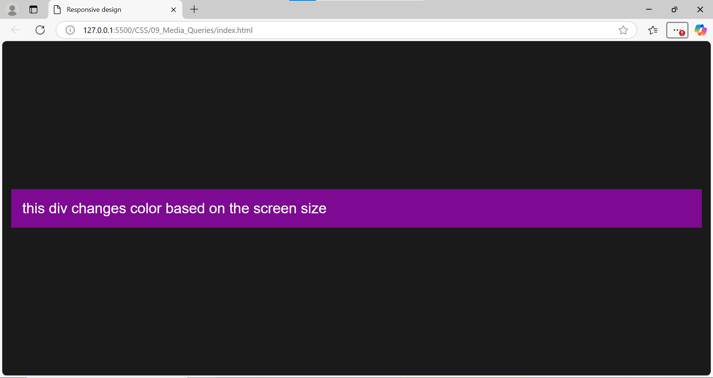
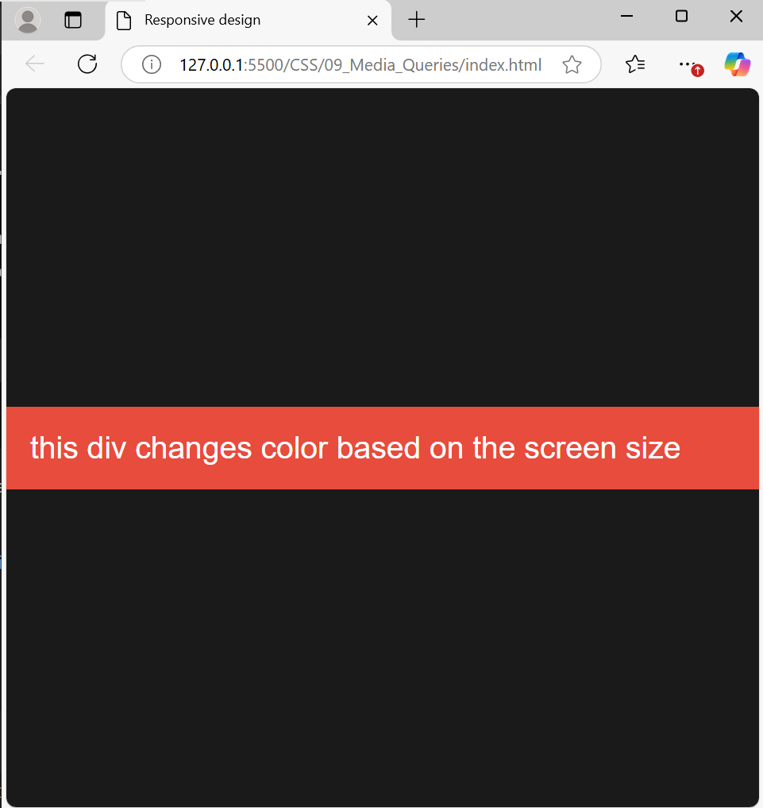
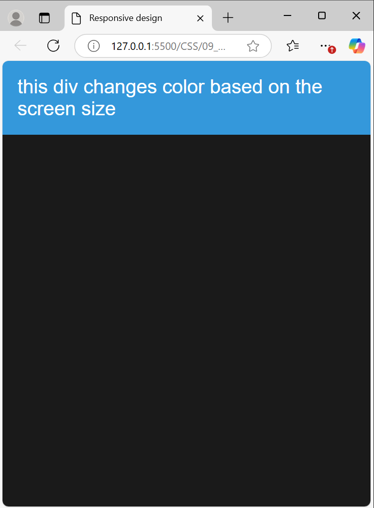

# Media Queries in CSS: A Beginner's Guide

Media queries are a key feature in CSS that allow you to apply styles conditionally based on the characteristics of the user's device, such as screen size, resolution, or orientation. They are essential for creating responsive web designs that look great on any device.

---

## What are Media Queries?

Media queries use the `@media` rule to define conditions (also known as breakpoints) under which specific styles will apply.

For example:

```css
@media (max-width: 768px) {
  body {
    background-color: lightblue;
  }
}
```

This applies the background color only when the viewport width is 768px or smaller.

---

## Syntax

A media query consists of:

1. **Media Type**: The type of device (e.g., `screen`, `print`).
2. **Media Feature**: A characteristic of the device (e.g., `max-width`, `orientation`).
3. **CSS Rules**: The styles to be applied if the conditions are met.

### Example Syntax

```css
@media media-type (media-feature) {
  /* CSS styles */
}
```

---

## Common Use Cases

### 1. Responsive Layouts

```css
@media (max-width: 600px) {
  .container {
    flex-direction: column;
  }
}
```

### 2. Orientation-Based Styling

```css
@media (orientation: landscape) {
  body {
    font-size: 18px;
  }
}
```

### 3. High-Resolution Screens

```css
@media (min-resolution: 2dppx) {
  img {
    width: 100px;
  }
}
```

---

## Logical Operators

You can combine multiple conditions using logical operators:

- **and**: Combines multiple conditions.

  ```css
  @media (min-width: 768px) and (orientation: portrait) {
    body {
      background-color: lightgreen;
    }
  }
  ```

- **or**, represented by a comma: Applies if any condition is true.

  ```css
  @media (max-width: 480px), (min-width: 1024px) {
    body {
      font-size: 14px;
    }
  }
  ```

- **not**: Negates a condition.
  ```css
  @media not all and (min-width: 768px) {
    body {
      display: none;
    }
  }
  ```

---

## Tips for Using Media Queries

1. Start with a mobile-first approach.
2. Use relative units like `em` or `rem` for breakpoints when possible.
3. Test your design on multiple devices.

---

## EXAMPLE

```html
<!DOCTYPE html>
<html lang="en">
  <head>
    <meta charset="UTF-8" />
    <meta name="viewport" content="width=device-width, initial-scale=1.0" />
    <title>Responsive design</title>
    <link rel="stylesheet" href="style.css" />
  </head>
  <body>
    <div class="responsive-div">
      this div changes color based on the screen size
    </div>
  </body>
</html>
```

```css
body {
  margin: 0;
  padding: 0;
  font-family: Arial, Helvetica, sans-serif;
  display: flex;
  justify-content: center;
  align-items: center;
  height: 100vh;
  background-color: #1a1a1a;
}
.responsive-div {
  width: 100%;
  max-width: 1200px;
  padding: 20px;
  color: #fff;
  font-size: 26px;
  background-color: #7e0a93;
}
@media (max-width: 600px) {
  body {
    align-items: flex-start;
  }
  .responsive-div {
    background-color: #3498db;
  }
}
@media (min-width: 601px) and (max-width: 1024px) {
  body {
    align-items: center;
  }
  .responsive-div {
    background-color: #e74c3c;
  }
}
```




